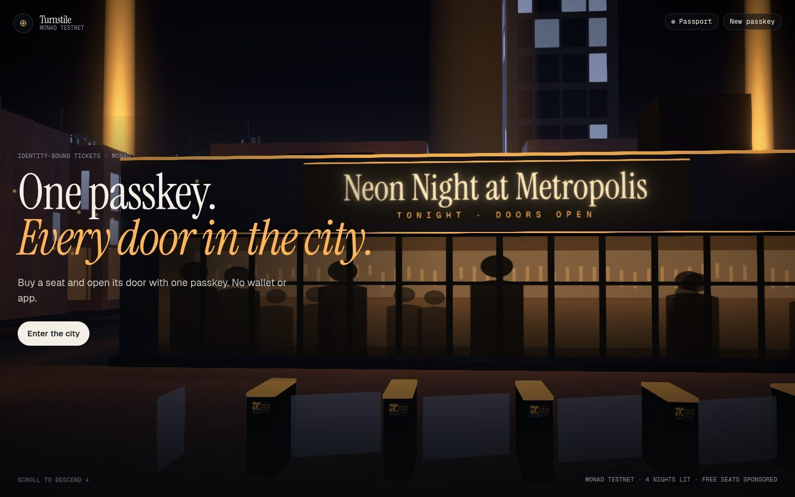
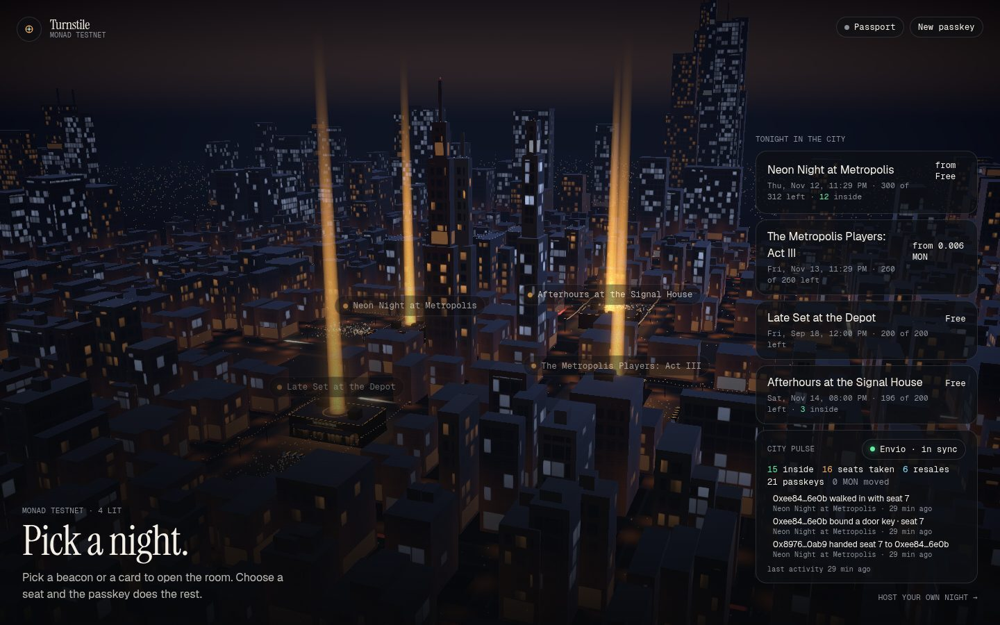
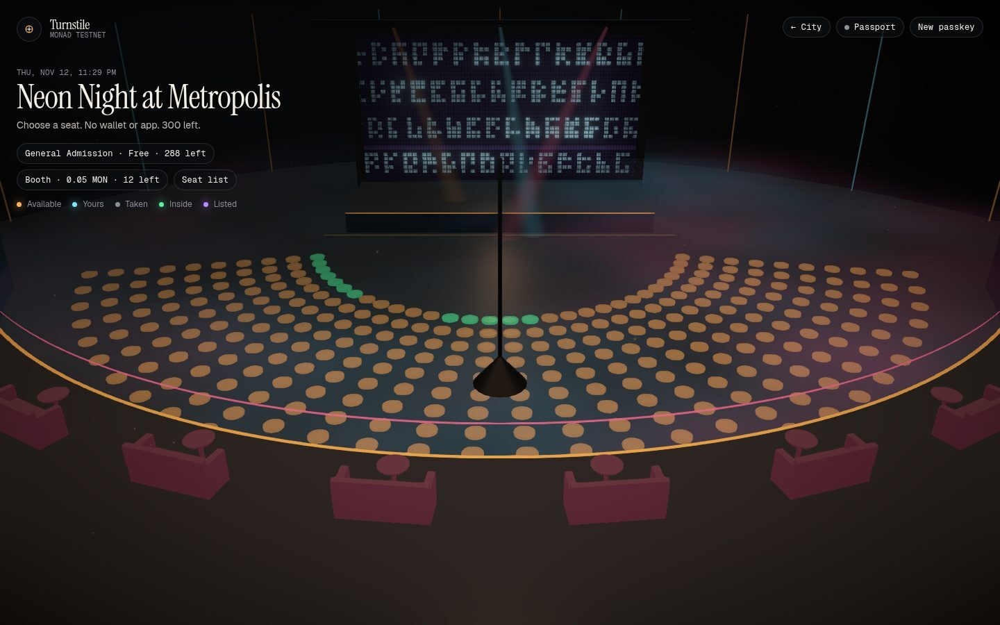
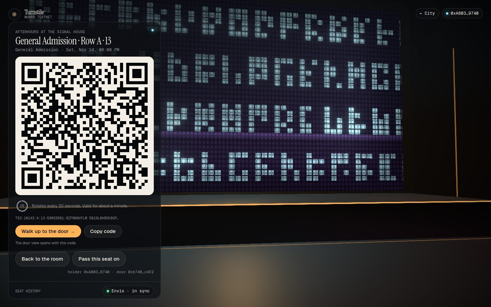
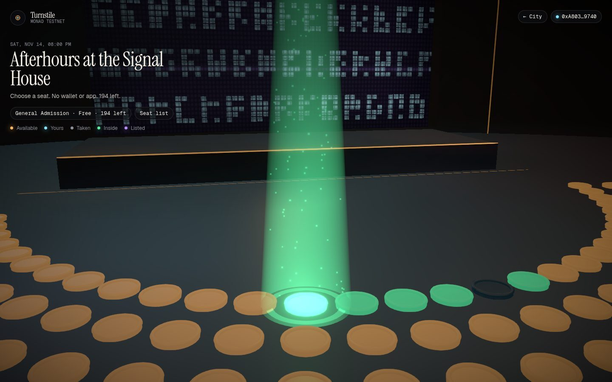

<p align="center">
  
</p>

# Turnstile

Identity-bound tickets and access on Monad. One passkey buys the seat, opens the door and holds a private
passport. There is no wallet app, no seed phrase and no screenshot that can be resold.

[](https://github.com/vaibhav0xq/turnstile/actions/workflows/ci.yml)
[](LICENSE)

- **Live app:** <https://turnstile.work>
- **Hackathon:** Monad Metropolis, Track 03: Social, Attention & Culture
- **Chain:** Monad testnet, chain ID `10143`
- **Demo video:** not recorded yet. The plan is in [`docs/demo-video-storyboard.md`](docs/demo-video-storyboard.md).

## Contents

- [Status](#status)
- [Overview](#overview)
- [Try it](#try-it)
- [Screens](#screens)
- [How it works](#how-it-works)
- [Design](#design)
- [Monad Metropolis](#monad-metropolis)
- [Repository map](#repository-map)
- [Security and operations](#security-and-operations)
- [Deployments](#deployments)
- [Run it locally](#run-it-locally)
- [Documentation](#documentation)
- [Author](#author)
- [License](#license)

## Status

Live on Monad testnet at <https://turnstile.work>. The contracts were deployed and verified on 14 September
2026, the hosted Envio indexer is in sync and every commit on `main` passes the same checks CI runs. Seats
are free or priced in testnet MON. Nothing in this repository has been audited or prepared for mainnet.

## Overview

Turnstile is a ticketing and door-access product where the ticket is bound to the person who bought it.
A passkey creates the account, buys the seat, derives a separate door key for the event and encrypts a
private passport, all from the same biometric and without a wallet app. Tickets are ERC-721 seats in a
per-event contract on Monad. The entry code on the ticket is signed by the door key, rotates every 30
seconds and is consumed on-chain once at the door. Resale is allowed at or under a cap the organiser sets
and a sale clears the seller's door key, so a screenshot or a forwarded code admits nobody.

## Try it

You need a passkey provider that supports the WebAuthn PRF extension.

- Verified: Android Chrome with Google Password Manager and a Windows laptop using that phone over the
  hybrid QR flow.
- Unverified, listed in [`docs/device-matrix.md`](docs/device-matrix.md): Safari with iCloud Keychain and
  Windows Hello on Windows 11 25H2. Both support PRF by their own documentation.
- Not supported: a Chrome profile that is not signed in and Bitwarden. Neither offers PRF and the app says
  so instead of failing quietly.

The path takes about a minute and two passkey prompts, three on authenticators that cannot evaluate PRF
while creating the passkey.

1. Open <https://turnstile.work> and enter the city. Pick a night from the list or tap a beacon.
2. Pick a seat. General Admission seats are free and the relayer pays the gas.
3. Approve the passkey prompt. It creates your account and opens a 15-minute session. The seat is
   minted to your account and the ticket opens with a link to the transaction on MonadVision.
4. Open the door from the ticket. One more prompt binds a door key that only works for this event. The
   ticket now shows an entry code that rotates every 30 seconds.
5. Tap **Walk up to the door**. The demo door reads the code, the relayer verifies it and submits
   `checkIn`. The seat lights up in the room and the city pulse records the entry.
6. Optional: pass the seat on from the ticket, write a private note in the passport or publish your own
   night from **Host your own night**.

Paid tiers are settled from the passkey account's own balance. On testnet the relayer tops up a new
account with 0.1 MON, limited per address and per day. Passkeys are scoped to `turnstile.work`, so a
synced passkey brings the same account back on any device.

Sessions are short on purpose. The account session lasts 15 minutes and the door key session an hour.
When one runs out the ticket says so and offers the next step: a stale code is re-signed without a prompt,
an expired door key is derived again with one prompt and an expired account session asks you to sign
again. **Forget this device** on the passport page clears what the browser stored. The passkey stays with
your passkey provider and signing in again restores the same account, seats and vault.

## Screens

| The city | The room |
| --- | --- |
|  |  |
| Every event is a lit building. The pulse card and the freshness chip read from Envio. | Seats are picked in 3D. Tiers are derived from the rows. |

| The ticket | After check-in |
| --- | --- |
|  |  |
| The entry code rotates every 30 seconds. Seat history comes from the indexer. | The seat is lit and the entry is on-chain. |

## How it works

```
passkey ──PRF──┬── account namespace ──▶ secp256k1 account (15-minute session)   buys, lists, receives splits
               ├── presence namespace ─▶ per-event door key (never funded)        signs rotating EIP-712 entry codes
               └── vault namespace ────▶ AES-256-GCM passport key                 encrypts the private passport
```

1. **Buy.** One prompt opens a 15-minute session. The relayer sponsors free seats and holder actions.
   Paid seats are sent from the passkey account and pay their price plus gas.
2. **Enter.** A fresh biometric at the door derives the event's door key. The code rotates every 30
   seconds and `checkIn` consumes it once, on-chain.
3. **Passport.** A name and a line about each night, encrypted in the browser and parked with the relayer
   as ciphertext. Writes are signed by the account key. Sign in on another device and it is all there.

## Design

- **One passkey, three keys.** The passkey's PRF output is split into an account namespace (a secp256k1
  account that buys, lists and receives splits), a presence namespace (a per-event door key that is never
  funded and can only sign entry codes for that event) and a vault namespace (an AES-256-GCM key for the
  passport). The derivation and wire formats are frozen in `packages/identity/SPEC.md` and pinned by
  vectors that every other package checks.
- **Tickets that follow the person.** Entry codes are EIP-712 signatures from the door key over the event,
  seat and 30-second time slot. `checkIn` verifies the bound key and consumes the code once. A resale
  clears the door key on-chain, so the old holder's codes stop working the moment the seat changes hands.
- **No wallet app and no gas on the sponsored path.** Calls go through an ERC-2771 forwarder. The relayer
  sponsors free seats and holder actions such as binding, listing and taking a free listing. Paid seats are
  sent from the passkey account itself and pay their price plus gas.
- **A live layer with no backend of its own.** The public pulse page (`/pulse`), the organiser board,
  the city pulse card, passport attendance history and seat provenance are read from the hosted Envio
  indexer. Each view carries a freshness chip that compares the indexer's head with the relayer's and says
  "unavailable" instead of inventing rows. The pulse page shows the query it runs.
- **A private passport.** Notes about each night are encrypted client-side with the vault key and stored
  at the relayer as ciphertext it cannot read. The key exists only in memory and is re-derived from the
  passkey on any device.

## Monad Metropolis

Built solo during the Metropolis build window (1 September to 13 October 2026). Track and bounties as
selected on the hackathon platform:

- **Track 03: Social, Attention & Culture.** A ticket and door product for communities, where the seat, the
  entry and the passport belong to one person.
- **Best Mera-Powered UX on Monad** (Monad Foundation). Mera passkeys are the entire account layer. There is
  no seed phrase, no extension and no custody backend. One prompt opens a 15-minute session that signs
  the rest without asking again. The door key is the one deliberate extra prompt.
- **Mera: One Passkey, Many Keys** (Monad Foundation). Mera's PRF-derived material feeds three separate
  namespaces: the account, the per-event door key and the passport vault key.
- **Best Use of Envio** (Envio). The hosted HyperIndex indexer in `packages/indexer` powers the public
  pulse page, the organiser board, the city pulse card, passport attendance history, ticket provenance and
  the freshness chips. Nothing in the live layer is read over RPC.
- **Best Projects using Alchemy** (Alchemy). Alchemy is the primary Monad testnet RPC for the relayer and
  the browser, with the public RPC as read fallback. Transactions stay pinned to the primary.

## Repository map

```
apps/web               city, venue, seat, ticket, door, resale and organiser views (React 19, React Three Fiber, Vite)
apps/relayer           sponsored ERC-2771 calls, gate verifier and checkIn, testnet drip, passport store (Hono)
apps/gate              the door scanner, served by apps/web at /gate/:address
packages/identity      passkey ceremonies, key derivation, EIP-712 Entry and BindDoorKey, vault and passport sync
packages/contracts     TurnstileFactory and TurnstileEvent (Foundry), live on Monad testnet
packages/indexer       Envio HyperIndex: events, seats, fans, door feed, stats
spike/                 the Mera spike: 17 derivation vectors and the device pages (frozen evidence)
docs/                  runbooks, device matrix, storyboard, spike report, build log
research/              hackathon report, build plan, notes and the saved official sources
```

## Security and operations

- The relayer limits its own spend: a reserve floor per wallet pauses sponsorship before the relayer or
  gate wallet is drained, rolling hourly and daily budgets apply per action class (relay, drip, check-in)
  and each address has a daily quota.
- Sends go through a bounded per-wallet queue that keeps transactions sequential, so nonces cannot race.
  The relayer runs as a single machine (`max machines = 1`) so reservations are exact.
- Per-IP limits are keyed on the proxy-written `X-Forwarded-For` hop, never on anything the client sends.
  `/api/ip` shows what the limiter sees for you and `/api/health` shows balances against the floors,
  budget use, queue depth and the RPC provider.
- Passkeys are scoped to one host. `www` and any alias redirect to the apex before anything is served.
- The door key never holds funds. The passport is stored as ciphertext. The demo door is open so anyone
  can complete the path; production doors require an operator token.
- Testnet only. See [`SECURITY.md`](SECURITY.md) for how to report a problem.

## Deployments

| Chain | Forwarder | Factory | Implementation | Events |
| --- | --- | --- | --- | --- |
| Monad testnet (10143) | [`0xf6b8…3F34`](https://testnet.monadvision.com/address/0xf6b8b8E2cF881b01fFbeb3e97004591201333F34) | [`0x5C6e…42B2`](https://testnet.monadvision.com/address/0x5C6e597E96cBDf408537611554E2a53Da75042B2) | [`0x7e17…Fa3f`](https://testnet.monadvision.com/address/0x7e17B9EE54e2F2058950181B09794590b87DFa3f) | club [`0x79a3…21B5`](https://testnet.monadvision.com/address/0x79a3e41Cbb8acd8c9A1A61a929bdBa302d3121B5), theatre [`0x9c4b…3029`](https://testnet.monadvision.com/address/0x9c4b7a654680b5a4d382b22bdAA10FB05DC23029) |

Deployed 14 September 2026 from block 62 312 597. All three contracts are verified on MonadVision.
`packages/contracts/deployments/10143.json` is the source of truth for the relayer, the indexer and the
web app. The runbook and gas figures are in [`docs/deploy-monad-testnet.md`](docs/deploy-monad-testnet.md).

## Run it locally

Requires Node 24 or newer and pnpm 10 (`corepack enable`), plus Foundry 1.8 or newer for `packages/contracts`.

```
pnpm install
pnpm check                          # biome, tsc, node tests, identity vector check
cd packages/contracts && forge soldeer install && forge test && cd ../..

anvil --chain-id 31337 --port 8545  # terminal 1: local Monad stand-in
pnpm dev:chain                      # once: deploy forwarder, factory and two seeded events
pnpm dev:relayer                    # terminal 2: http://127.0.0.1:8787 (anvil keys in apps/relayer/.env)
pnpm dev:web                        # terminal 3: http://127.0.0.1:5173
pnpm smoke                          # optional: buy, bind, resale round trip, entry code and check-in
```

`pnpm verify` is the commit gate: frozen-lockfile install, `pnpm check`, a full build and the contracts'
own check (`forge fmt --check`, `forge lint`, build, tests and the gas snapshot). Every commit on `main`
comes from a tree that passed it and CI re-runs the same steps.

The same smoke runs against production from `apps/relayer` with
`RELAYER_URL=https://turnstile.work node scripts/smoke.mjs`. A headless guided run
(`pnpm --filter @turnstile/web run judge -- --base <origin>`) drives Chromium through the two-minute
path with a virtual passkey and prints per-step timings. It is developer tooling and is not linked from
the product.

## Documentation

- [`docs/build-log.md`](docs/build-log.md): dated build log from the identity spike to the live domain.
- [`docs/deploy-monad-testnet.md`](docs/deploy-monad-testnet.md): testnet deployment runbook.
- [`docs/envio-hosted-handoff.md`](docs/envio-hosted-handoff.md): the hosted indexer and the queries that prove it.
- [`docs/device-matrix.md`](docs/device-matrix.md): real-device passkey results.
- [`docs/mera-spike-report.md`](docs/mera-spike-report.md): Mera API findings and the derivation vectors.
- [`packages/identity/SPEC.md`](packages/identity/SPEC.md): key derivation, wire formats and the prompt budget.
- [`SECURITY.md`](SECURITY.md): supported branch, scope and how to report a problem.
- [`CONTRIBUTING.md`](CONTRIBUTING.md): setup, the commit gate and conventions.

## Author

Built solo by [Vaibhav](https://x.com/vaibhav_0xq) for Monad Metropolis. Questions and feedback are welcome on X.

## License

MIT License. See [LICENSE](LICENSE) for the full text.
